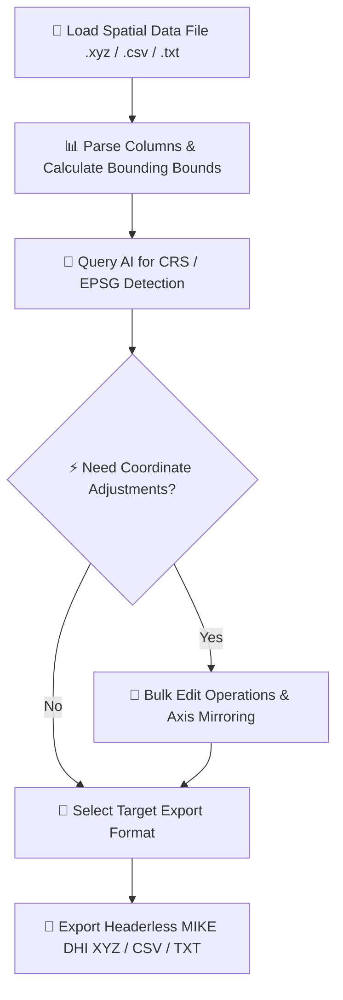

# 🏔️ Everest — Spatial Coordinate & XYZ Data Editor

[](https://www.python.org/)
[](https://flask.palletsprojects.com/)
[](https://mistral.ai/)
[](https://www.dhigroup.com/)
[](https://github.com/omidabduli/everest-coordinate-editor/releases/latest)
[](https://github.com/omidabduli)

> **Everest** is a specialized in-browser spatial coordinate editor, point-cloud transformer, and AI-assisted data management workspace built for environmental modelers, hydrologists, GIS analysts, and coastal engineers. It combines local AI Coordinate Reference System (CRS) identification, batch matrix transformations, spatial reflection/mirroring, and native export for MIKE by DHI numerical modeling systems.

---

## 🚀 Key Features

* **🤖 AI-Powered CRS & EPSG Identification**: Connects directly to Mistral AI (`mistral-small-latest`) via server proxy or client key to automatically detect spatial coordinate systems from raw coordinate ranges and output exact projection strings required by MIKE by DHI.
* **⚡ Vectorized Bulk Column Operations**: Apply linear scale factors, shift offsets, mathematical expressions (multiply, divide, add, subtract), decimal precision rounding, or substring replacements across millions of rows in real-time.
* **↔ Point-Cloud Spatial Reflection & Mirroring**: Instantly mirror spatial grids along X, Y, or Z axes relative to the point-cloud's automatic bounding-box center.
* **📊 Live Statistical Bounding Summaries**: Displays instant minimum and maximum bounds for every coordinate column ($X_{\min}, X_{\max}, Y_{\min}, Y_{\max}, Z_{\min}, Z_{\max}$) for fast spatial extent validation.
* **💾 Native MIKE by DHI XYZ Support**: Export sanitized point data directly to space-separated XYZ format (headerless format tailored for MIKE Zero / MIKE 21 / MIKE 3 mesh generators), CSV, or tab-delimited TXT files.
* **🎨 Modern Responsive Interface**: Sleek dark-mode workspace powered by Glassmorphism design tokens, keyboard navigation, and client-side privacy protection.

---

## 🛠️ How It Works (Step-by-Step Workflow)



1. **Load Spatial File 📂**: Drag and drop any space-delimited `.xyz`, comma-separated `.csv`, or tab-delimited `.txt` spatial point file into the workspace.
2. **Inspect & Range Audit 📊**: Review live statistics cards showing total row counts, total columns, and min/max spatial boundaries across all dimensions.
3. **Detect CRS 🤖**: Click **Detect CRS with AI** to send coordinate sample bounds to Mistral AI and receive exact EPSG codes and MIKE DHI projection names.
4. **Transform Coordinates ⚡**: Perform bulk mathematical operations (e.g., convert feet to meters, shift datum elevation, mirror point-cloud orientation).
5. **Export & Integrate 💾**: Download formatted XYZ files ready for immediate import into DHI mesh generation software or GIS suites.

---

## ⚙️ Under The Hood (Technical Details)

### 1. AI-Driven Coordinate Reference System (CRS) Detection 🤖
Raw spatial files often lack explicit projection metadata. Everest proxies coordinate samples through Flask to Mistral AI:
$$\text{Prompt} \rightarrow \text{Mistral API} \rightarrow \{\text{EPSG Code, WKT Name, MIKE DHI Projection String}\}$$

### 2. Spatial Reflection & Bounding Box Centering ↔
Axis mirroring reflects points across the automatic geometric mid-point of the dataset:
$$X_{\text{mid}} = \frac{\min(X) + \max(X)}{2}, \quad X' = 2 \cdot X_{\text{mid}} - X$$

### 3. MIKE by DHI Format Specification Compliance 💾
MIKE DHI mesh generators require strict numerical formatting without header contamination:
```text
354200.50 5641000.25 -12.45
354210.00 5641005.00 -12.30
354220.75 5641010.50 -12.10
```

---

## ⚙️ Main Entry Point & Quick Start

### Prerequisites
- **Python 3.9+**
- Packages listed in `requirements.txt` (`Flask`, `requests`, `python-dotenv`)

### Installation & Launch

1. **Clone repository**:
   ```bash
   git clone https://github.com/omidabduli/everest-coordinate-editor.git
   cd everest-coordinate-editor
   ```

2. **Install dependencies**:
   ```bash
   pip install -r requirements.txt
   ```

3. **Configure Environment (Optional for AI CRS Detection)**:
   Create a `.env` file in the root directory:
   ```env
   MISTRAL_API_KEY=your_mistral_api_key_here
   ```
   *(Alternatively, configure your API key directly within the app settings modal).*

4. **Run Server**:
   ```bash
   python app.py
   ```
   Open your browser at `http://localhost:5007`.

5. **Quick Launchers**:
   - **macOS / Linux**: Double-click or run `./RUN_EVEREST.command`
   - **Windows**: Double-click `RUN_EVEREST.bat`

---

## 🗂️ Project Directory Structure

```text
everest-coordinate-editor/
├── index.html              # Modern dark-mode web app interface (HTML5 / Vanilla CSS / JS)
├── app.py                  # Python Flask server & Mistral AI proxy endpoint
├── requirements.txt        # Python package dependencies
├── RUN_EVEREST.command     # One-click macOS / Linux shell launcher
├── RUN_EVEREST.bat         # One-click Windows batch launcher
├── .env                    # Local environment config (API keys)
└── .gitignore              # Git file exclusion rules
```

---

## Author

**Developed and maintained by [Omid Abduli](https://github.com/omidabduli)**

[Roland Digital](https://roland-digital.de/) · Germany

*In-browser spatial coordinate editor, point-cloud transformer, and AI-powered CRS detection workspace for MIKE by DHI & GIS workflows.*

